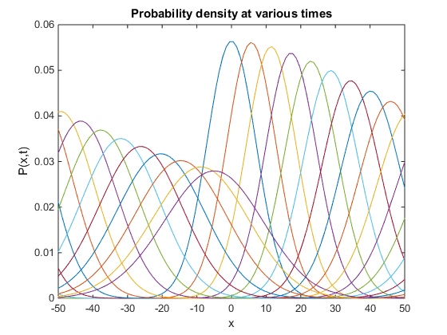

# hw_schrodinger
Homework for Garcia Ch. 9, implicit schemes for Schrodinger equation

  
*   [Problem 1 (in-class)](#2)

## Problem 1 (in-class)

Complete <tt>Schrodinger_exercise.m</tt> so that it can run the Implicit FTCS and Crank-Nicolson schemes to solve for the wave function and probabilities of a free particle wave packet (potential = 0 everywhere). Use periodic boundary conditions.

Your final 2D plot of several probability steps should look something like this (Implicit FTCS, time step of 0.001):

